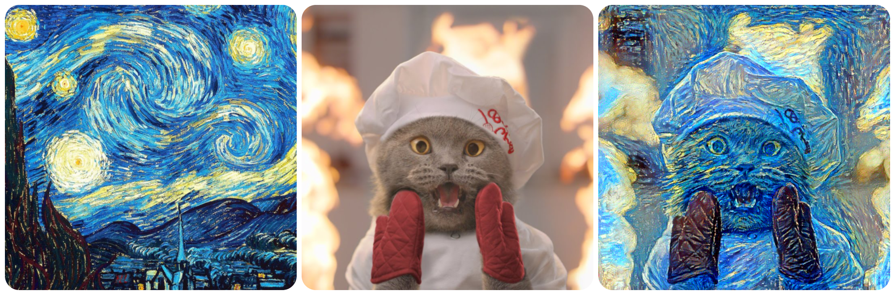
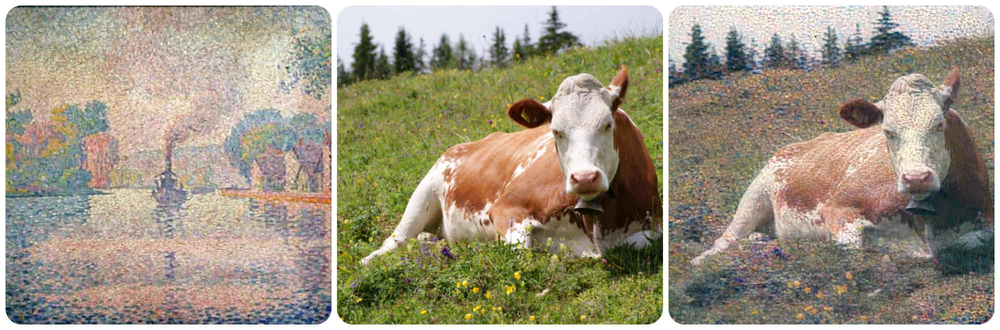
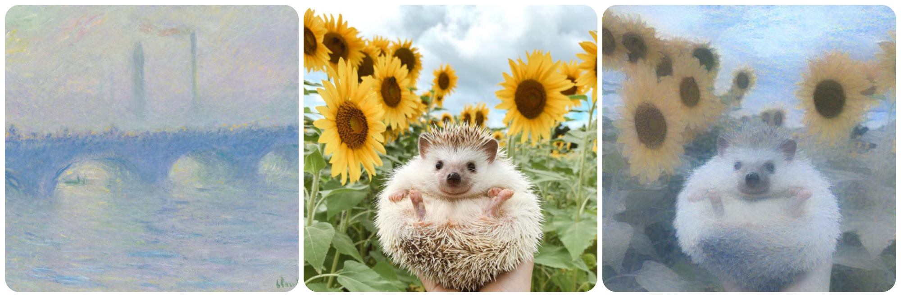
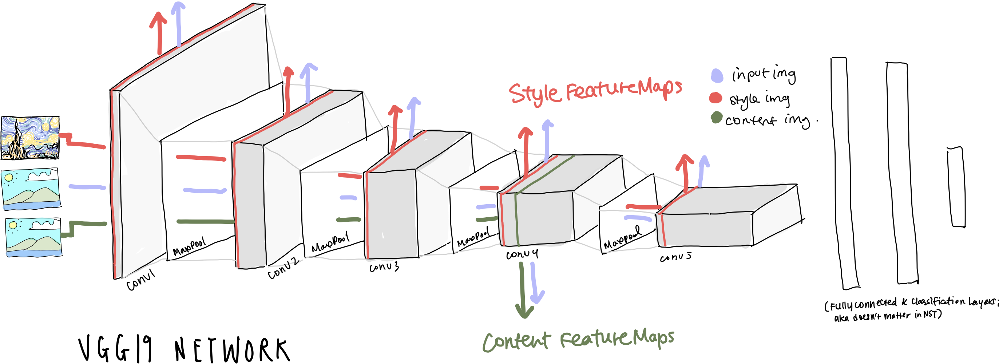
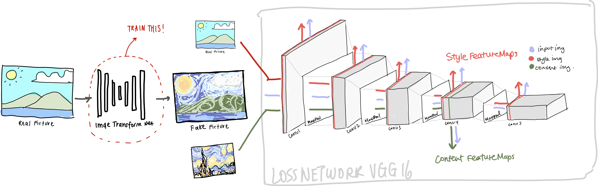
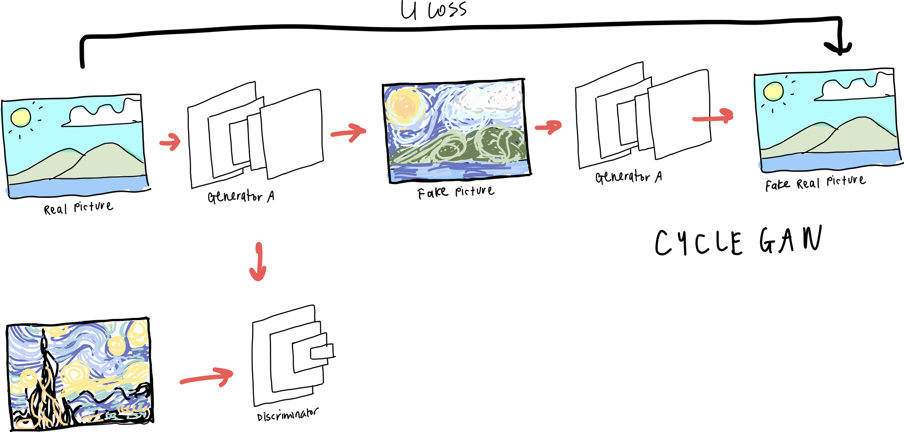

# neural style transfer w/ pytorch

This is a Pytorch implementation of different papers for nst & some quick explanation/notes on each one. The goal of neural style transfer is to preserve the content of an image we want to transform to pick up on stylistic patterns in another image & papers are linked below. 

## Example Images 

## [Gatys et al](https://arxiv.org/abs/1508.06576)

This was the earliest and most basic of the three implementations. Gatys starts off by using a pre-trained image-classification neural network (we use VGG19 here). Pretrained networks are interesting because [we know](https://arxiv.org/abs/1311.2901) that lower layers of the network pick up on “local features” (edges, corners, diagonals, colors) but as the network gets deeper, the further layers pick up on more general items (say, identify a face, clouds, or complex animal shapes). These features can help us identify how to transfer the features like texture/color of one image onto the content of another. 

In other words, the idea here is to extract layers of the network in a way so we can calculate how much a given input resembles the **content** of the original image, and the **style** of another image. Then, we can minimize the sum of the “content loss” (or the difference in the displays of content) and the “style loss” by tuning the input. When the total loss reaches a minimum, we get a picture that preserves the content and style of both images. 

In more detail, we begin by passing the content image and the style image into VGG16, and extracting the feature maps calculated ([Conv4_2], [Conv1_1, Conv2_1, Conv3_1, Conv4_1, Conv5_1] for content and style respectively). Next, we pass the input image we’re trying to tune through the VGG16 and extract all the same feature maps as well. To calculate the similarity between the input and the content image, we can simply take the absolute difference in feature maps for Conv4_2 (this can be accomplished with MSELoss). Style loss is a little more tricky - it first requires finding the spacial correlation in a feature map (basically, the degree to which individual channels are correlated with each other), and then finding the differences in the spatial correlation. This can be done using a Gram Matrix (more [details](https://towardsdatascience.com/neural-networks-intuitions-2-dot-product-gram-matrix-and-neural-style-transfer-5d39653e7916) here). Finally, we can backpropagate the graph to update the input accordingly, minimizing both the content & style loss. 

Here are [some](https://12ft.io/proxy?q=https://towardsdatascience.com/breaking-down-leon-gatys-neural-style-transfer-in-pytorch-faf9f0eb79db) [other](https://medium.com/geekculture/neural-image-style-transfer-515fe09f1c0c), more [thorough](https://www.youtube.com/watch?v=R39tWYYKNcI&ab_channel=DeepLearningAI) explanations that’ll probably help for reference.

## [Johnson et al.](https://arxiv.org/abs/1603.08155)

Johnson’s paper detailed a problem with Gatys’ NST: it was pretty slow to generate any given image and could not transfer style in, for instance, a real-time video that demanded high speed transfer of style. 

The idea of Fast NST is very similar to the first. Instead of tuning the input image, a given content input would first pass through a neural network called the Image Transform Net, such that in an optimal world the network has performed the style transfer on the input. The following transformed image now would be evaluated in a similar way as Gatys - it’s passed though a pre-trained classifier network & its content/style losses are evaluated in comparison to the original input image & a style image. Finally, the network uses this loss to update the parameters for the Image Transform Network. 

In sum, Johnson’s Fast NST is very similar to Gatys except for a few key things. 1. The input image is not the one updated/trained: the image transform network is. Hence, with its many layers/parameters, lots of images (commonly, the CoCo Dataset is used) are required to train the network & it is much, much slower to train. 2. The network, after training, is significantly faster than Gatys’ NST & can transfer images in video-real time. 

[Here](https://medium.com/red-buffer/johnson-et-al-style-transfer-in-tensorflow-2-0-57cfcba8af36) are some more detailed references. 

## [CycleGANs](https://arxiv.org/abs/1703.10593) (w/ original [repo](https://junyanz.github.io/CycleGAN/))

CycleGANs are a way to solve the Image-to-Image Translation problem, which is taking an image and synthesizing another image that modifies some part of it. For example, if you want to change a picture of a horse into a picture of a zebra, or a picture of Yosemite in the summer into one in the winter, this can be considered Image-to-Image translation problem. 

CycleGANs are an extension of GANs, or Generative Adversarial Networks. For a brief explanation, GANs are composed of two networks who are “competing” with each other - a generator and a discriminator. The generator’s goals is to generate a synthetic image that is very similar to an actual image, while the discriminator’s goals is to differenciate between the real image provided and the fake image generated by the network. Basically, the generator is in a constant attempt to “fool” the discriminator. For a better/deeper review of GANs, these are good [resources](https://jonathan-hui.medium.com/gan-gan-series-2d279f906e7b). 

CycleGANs work through using two generators and two discriminators. We can call them generators A, B and discriminators A, B. Say we want to implement the Van Gogh style onto a real landscape image. In the first cycle, generator A takes a real image and transfers the Van Gogh style onto it. Next, generator B works in the opposite direction by taking the “fake van gogh” and generates a real image from it. Two losses are now calculated —> the first is from discriminator A and calculates the loss through differentiating the fake van gogh from a real one. The second loss is calculated through the difference between the original real image and the “real image” generated by generator B. (In an ideal world, those images would be identical). 

This process is repeated, but in the second loop we start with generator B, where a real image is generated from a van Gogh painting, and then generator A will generate the van Gogh painting using the real image. Now discriminator B is used to differentiate a fake ‘real image’ from an actual landscape photo. 

This loops is trained for a number of epochs through all the training photos, until both generators are able to create realistic van Goghs from real images, or realistic landscapes from van Goghs. Here are some [helpful](https://jonathan-hui.medium.com/gan-cyclegan-6a50e7600d7) [stuffs](https://medium.com/data-science-in-your-pocket/understanding-cyclegans-using-examples-codes-f5d6e1a47048).

## stuff that helped:

[johnson in tensorflow](https://medium.com/red-buffer/johnson-et-al-style-transfer-in-tensorflow-2-0-57cfcba8af36)

[official pytorch nst guide](https://pytorch.org/tutorials/advanced/neural_style_tutorial.html) 

[official cyclegan repo](https://junyanz.github.io/CycleGAN/) 

[official fastnst repo](https://github.com/jcjohnson/fast-neural-style) 

## Future stuff:

Since the latter two implementations are super computationally intensive, I wasn’t able to fully train a good model from both. I probably want to train these networks after figuring out the cheapest way to (?). Also on the agenda is figuring out how to deploy ML models to websites/cloud & probably getting into transformers/nlp next :D
